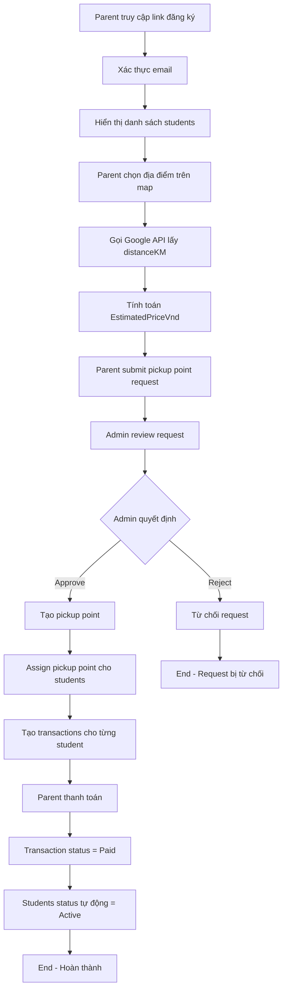

# 🚌 PICKUP POINT REGISTRATION FLOW & API TESTING GUIDE

## 📋 Tổng quan luồng đăng ký pickup point

### 🔄 **LUỒNG LOGIC HOÀN CHỈNH**



---

## 🎯 **CHI TIẾT TỪNG BƯỚC**

### **1. Xác thực Email (Guest)**
- **Input**: Email của parent
- **Process**: Kiểm tra email có tồn tại trong hệ thống không
- **Output**: Danh sách students thuộc về email đó

### **2. Chọn địa điểm & Tính toán**
- **Input**: Tọa độ latitude, longitude từ map
- **Process**: 
  - Gọi Google Distance Matrix API
  - Lấy `distanceKM`
  - Tính `EstimatedPriceVnd = distanceKM × UnitPriceVndPerKm`
- **Output**: Thông tin giá ước tính

### **3. Submit Request**
- **Input**: Thông tin pickup point request
- **Process**: Lưu request với status = "Pending"
- **Output**: Request ID để admin review

### **4. Admin Review & Approve**
- **Input**: Request ID, Admin ID, Notes
- **Process**:
  - Cập nhật status = "Approved"
  - Tạo pickup point mới
  - Assign pickup point cho students
  - **Tự động tạo transactions cho từng student**
- **Output**: Pickup point được tạo, students được assign

### **5. Payment & Auto Status Update**
- **Input**: Transaction ID, Payment info
- **Process**:
  - Cập nhật transaction status = "Paid"
  - **Tự động cập nhật students status = "Active"**
- **Output**: Students sẵn sàng sử dụng dịch vụ

---

## 🧪 **HƯỚNG DẪN TEST API**

### **📋 Chuẩn bị test data**

#### **1. Tạo Parent (nếu chưa có)**
```bash
POST /api/debug/create-parent
Content-Type: application/json

{
  "email": "test.parent@example.com",
  "firstName": "Test",
  "lastName": "Parent",
  "phoneNumber": "0123456789"
}
```

#### **2. Tạo Students cho parent**
```bash
POST /api/student
Content-Type: application/json

{
  "firstName": "Student",
  "lastName": "One",
  "parentEmail": "test.parent@example.com",
  "status": 0
}
```

### **🔍 Test Flow từng bước**

#### **Bước 1: Kiểm tra parent và students**
```bash
# Kiểm tra parent
GET /api/debug/check-parent/test.parent@example.com

# Kiểm tra students
GET /api/debug/list-students-by-parent-email/test.parent@example.com
```

#### **Bước 2: Tạo pickup point request**
```bash
POST /api/pickup-point/submit-request
Content-Type: application/json

{
  "parentEmail": "test.parent@example.com",
  "studentIds": ["student-id-1", "student-id-2"],
  "addressText": "123 Test Street, Test City",
  "latitude": 15.999970057832032,
  "longitude": 108.26771115560736,
  "distanceKm": 3.5,
  "description": "Test pickup point request",
  "reason": "Convenient location for pickup",
  "unitPriceVndPerKm": 50000,
  "estimatedPriceVnd": 175000
}
```

#### **Bước 3: Admin approve request**
```bash
POST /api/pickup-point/approve-request
Content-Type: application/json

{
  "requestId": "request-id-from-step-2",
  "adminId": "550e8400-e29b-41d4-a716-446655440001",
  "notes": "Approved for testing"
}
```

#### **Bước 4: Kiểm tra transactions được tạo**
```bash
# Xem tất cả transactions
GET /api/transaction/admin/list?page=1&pageSize=10

# Xem transactions của parent cụ thể
GET /api/transaction/parent/transactions?parentId=parent-id
```

#### **Bước 5: Test payment (mark as paid)**
```bash
POST /api/payment/mark-as-paid
Content-Type: application/json

{
  "transactionId": "transaction-id-from-step-4",
  "note": "Payment completed for testing"
}
```

#### **Bước 6: Kiểm tra students status tự động cập nhật**
```bash
# Kiểm tra students status
GET /api/student?parentEmail=test.parent@example.com

# Hoặc kiểm tra student cụ thể
GET /api/student/{student-id}
```

---

## 🔧 **API ENDPOINTS CHÍNH**

### **Pickup Point APIs**
- `POST /api/pickup-point/submit-request` - Submit pickup request
- `GET /api/pickup-point/requests` - Get all requests (admin)
- `POST /api/pickup-point/approve-request` - Approve request
- `POST /api/pickup-point/reject-request` - Reject request

### **Transaction APIs**
- `GET /api/transaction/admin/list` - Get all transactions (admin)
- `GET /api/transaction/parent/transactions` - Get parent transactions
- `GET /api/transaction/{id}` - Get transaction detail
- `POST /api/transaction/create` - Create transaction manually

### **Payment APIs**
- `POST /api/payment/mark-as-paid` - Mark transaction as paid
- `POST /api/payment/webhook` - PayOS webhook
- `GET /api/payment/status/{transactionId}` - Check payment status

### **Student APIs**
- `GET /api/student` - Get students
- `GET /api/student/{id}` - Get student detail
- `POST /api/student/activate/{id}` - Activate student
- `POST /api/student/deactivate/{id}` - Deactivate student

### **Debug APIs**
- `GET /api/debug/check-parent/{email}` - Check parent exists
- `GET /api/debug/check-student/{id}` - Check student exists
- `GET /api/debug/list-students-by-parent-email/{email}` - List students by parent email
- `POST /api/debug/create-parent` - Create parent for testing

---

## ⚠️ **LƯU Ý QUAN TRỌNG**

### **1. Auto Transaction Creation**
- Khi admin approve pickup request, hệ thống **tự động tạo 1 transaction cho mỗi student**
- Mỗi transaction có `EstimatedPriceVnd` từ request
- Transaction status mặc định = "Pending"

### **2. Auto Student Status Update**
- Khi transaction chuyển sang "Paid", **tất cả students liên quan tự động chuyển sang "Active"**
- Chỉ áp dụng cho students có status = "Available" hoặc "Pending"

### **3. Error Handling**
- Nếu parent không tồn tại → Tự động tạo parent mới
- Nếu student không tồn tại → Bỏ qua, tạo transaction cho students còn lại
- Tất cả lỗi được log chi tiết trong console

### **4. Database Requirements**
- Parent phải tồn tại trong `Parents` table
- Students phải có `ParentEmail` khớp với parent
- Transaction cần có `TransportFeeItems` liên kết với students

---

## 🎯 **TEST SCENARIOS**

### **Scenario 1: Happy Path**
1. Tạo parent + students
2. Submit pickup request
3. Admin approve
4. Kiểm tra transactions được tạo
5. Mark transaction as paid
6. Kiểm tra students status = Active

### **Scenario 2: Parent không tồn tại**
1. Submit request với email chưa có parent
2. Hệ thống tự động tạo parent
3. Tiếp tục flow bình thường

### **Scenario 3: Student không tồn tại**
1. Submit request với student ID không tồn tại
2. Hệ thống bỏ qua student đó
3. Tạo transaction cho students còn lại

### **Scenario 4: Reject Request**
1. Submit request
2. Admin reject
3. Không tạo transaction
4. Students không thay đổi status

---

## 📊 **MONITORING & DEBUGGING**

### **Console Logs**
- `Creating transaction for request {id}` - Bắt đầu tạo transaction
- `Found parent: {id}` - Tìm thấy parent
- `Student not found: {id}` - Student không tồn tại
- `Transaction created successfully: {id}` - Transaction tạo thành công
- `Students activated after payment` - Students được kích hoạt

### **Database Checks**
```sql
-- Kiểm tra pickup requests
SELECT * FROM PickupPointRequests WHERE Status = 'Approved'

-- Kiểm tra transactions
SELECT * FROM Transactions WHERE Status = 'Paid'

-- Kiểm tra students status
SELECT * FROM Students WHERE Status = 2 -- Active
```

---

## 🚀 **QUICK START TEST**

```bash
# 1. Tạo parent
curl -X POST "https://localhost:7061/api/debug/create-parent" \
  -H "Content-Type: application/json" \
  -d '{"email":"test@example.com","firstName":"Test","lastName":"Parent"}'

# 2. Submit request
curl -X POST "https://localhost:7061/api/pickup-point/submit-request" \
  -H "Content-Type: application/json" \
  -d '{"parentEmail":"test@example.com","studentIds":["student-id"],"addressText":"Test Address","latitude":15.99,"longitude":108.26,"distanceKm":3.5,"estimatedPriceVnd":175000}'

# 3. Approve request
curl -X POST "https://localhost:7061/api/pickup-point/approve-request" \
  -H "Content-Type: application/json" \
  -d '{"requestId":"request-id","adminId":"550e8400-e29b-41d4-a716-446655440001","notes":"Test approval"}'

# 4. Check transactions
curl -X GET "https://localhost:7061/api/transaction/admin/list?page=1&pageSize=10"

# 5. Mark as paid
curl -X POST "https://localhost:7061/api/payment/mark-as-paid" \
  -H "Content-Type: application/json" \
  -d '{"transactionId":"transaction-id","note":"Test payment"}'
```

---

## ✅ **KẾT LUẬN**

Luồng đăng ký pickup point đã được thiết kế hoàn chỉnh với:
- ✅ **Auto transaction creation** khi admin approve
- ✅ **Auto student status update** khi payment thành công  
- ✅ **Error handling** cho các trường hợp edge case
- ✅ **Comprehensive API testing** với debug endpoints
- ✅ **Detailed logging** để monitoring và debugging

**Hệ thống sẵn sàng cho production!** 🎉
